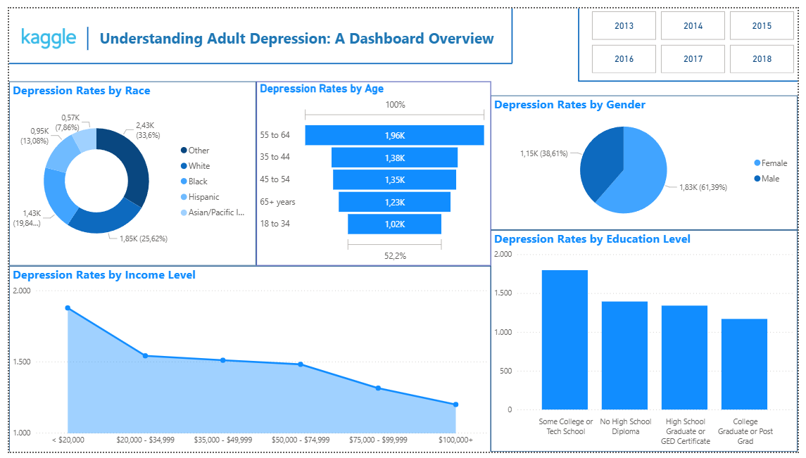

# Adult Depression: Data Modeling and Visualization

## 📌 Project Description
This project is a **scientific research (penelitian ilmiah)** created as part of the coursework for the subject **Pengantar Sains Data (Introduction to Data Science)**.  
It analyzes adult depression rates using public health survey data from Kaggle, combining **data modeling** to identify influencing factors and **visualization** to present insights interactively.

---

## Dataset
- **Source**: [Kaggle - Adult Depression Dataset](https://www.kaggle.com/)
- **Format**: CSV
- **Key Attributes**:
  - Age group
  - Gender
  - Race
  - Income level
  - Education level
  - Depression diagnosis status

---

## Data Modeling
The research was guided by the central question:  
**“What factors influence the percentage of depression in adults, and to what extent can this percentage be predicted from the available data?”**

A predictive modeling approach was applied to the dataset to explore and quantify the most influential factors.  
The best-performing model achieved an **R² score of 99.9%**, indicating:
- Extremely high prediction accuracy.
- A strong ability to explain the variance in the target variable (adult depression percentage).

---

## Visualization Summary
The interactive Power BI dashboard presents adult depression rates segmented by demographic and socioeconomic factors.  
It provides a clear overview of how depression prevalence differs across groups.

---

## Key Insights
1. **By Race**  
   - Highest prevalence among *Other* (33.6%), followed by *White* (25.6%) and *Black* (19.8%).
   - Asian/Pacific Islander and Other categories have lower rates (<7%).

2. **By Age Group**  
   - Highest rates: **55–64 years** (~1.96K cases).  
   - Lowest rates: **18–34 years** (~1.02K cases).

3. **By Gender**  
   - Males have higher prevalence (61.4%) compared to females (38.6%).

4. **By Income Level**  
   - Depression rates decline as income increases.  
   - Highest in `< $20,000` income group; lowest in `$100,000+`.

5. **By Education Level**  
   - Highest rates among *Some College or Technical School*.  
   - Lowest among *College Graduates or Postgraduates*.

---

## Visualization Preview

